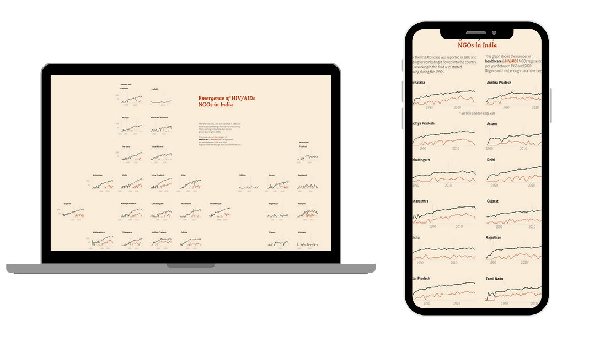
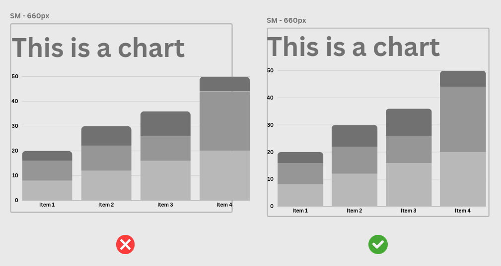
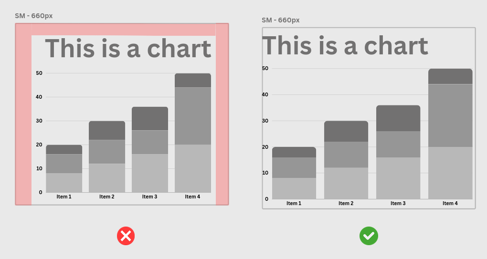
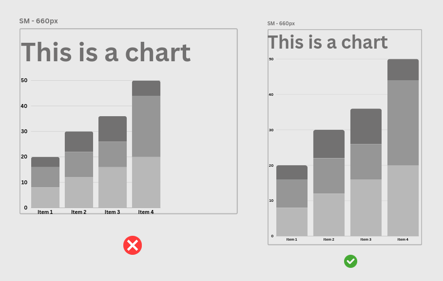
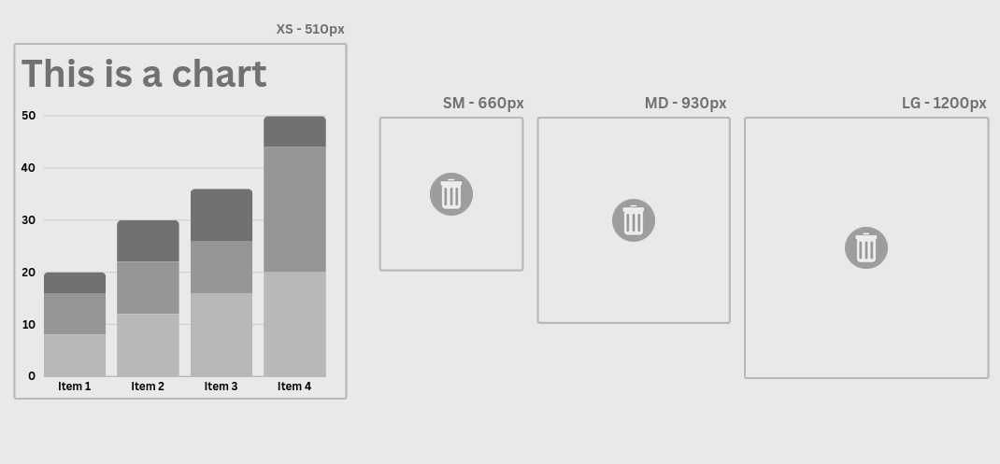
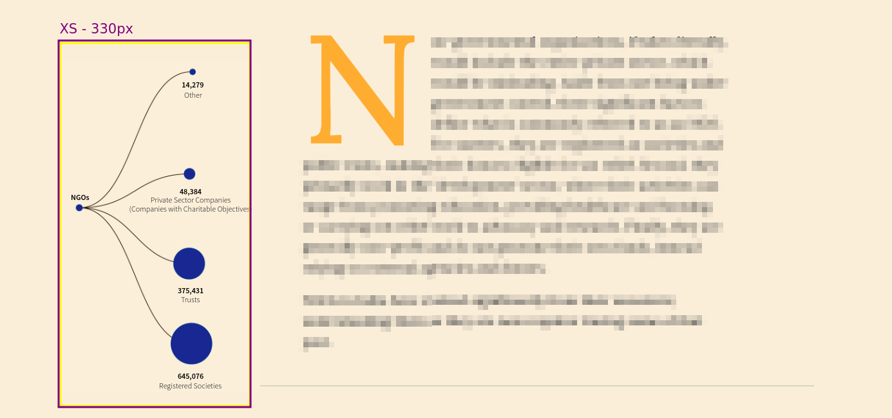
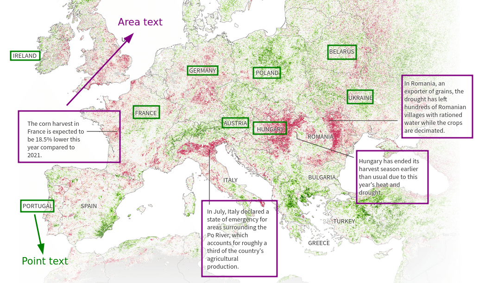
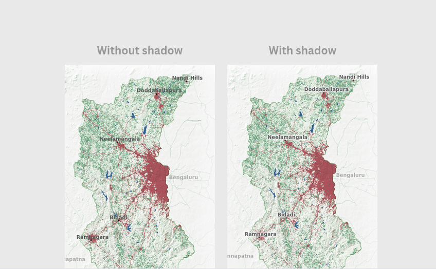

## Requirements

1. **Adobe Illustrator**. If you have it, great. If not, ask Aman to hook you up.
2. **Ai2Svelte script**: Once AI is installed, you will need to include the ai2svelte js script. Download and save [this file](https://github.com/reuters-graphics/ai2svelte) into your laptop.

## Installing the script

Move the ai2html.js file into the Illustrator folder [where scripts are located](https://ai-scripting.docsforadobe.dev/introduction/executingScripts.html#installing-scripts-in-the-scripts-menu). For example, on Mac OS X running Adobe Illustrator CC 2014, the path would be: `Adobe Illustrator CC 2014/Presets/en_US/Scripts/ai2html.jsx`.

You will have to restart your Illustrator for the script to show up in `File > Scripts`.

## What it does

The idea behind converting static graphics to HTML (or in our case, Svelte) "artboards" is that we can design for different screen sizes just as we would in something like Canva, but in our exports the **text remains selectable**, which is important because it means it is **not part of the image**. From [their website](https://ai2html.org):

> The script renders text as absolutely positioned html elements. The remaining art is exported as an image that is placed underneath the text in the html.

That means at any screen size, provided there's an artboard for it, the text will be crisp and clear and not pixelate as text tends to. As a bonus, since the output text is HTML, we can **style it on the fly during development as well**. And anything that is not text is saved as an image.

That means we can do cool stuff very easily! Depending on the screen size, we can create fancy layouts meant specifically for that device.



In the two graphics above, all the charts and text were positioned in Illustrator and available as an embeddable HTML file after processing. The map of India with small multiples morphs into a two columned grid because thats what makes most sense on mobile. **You don't have to depend on the development team to translate your innovative layouts to code** for most static charts and sections, you can take control of it yourself.

## Get started

For any new project, you'll want to first download the Illustrator template from [here]. Open it up!

## Understanding template

### Artboards

On opening, you'll be greeted with five blank artboards. Each artboard corresponds to a specific **breakpoint width** for which it will be used.

1. **XS** (Extra Small): For screens **up to 510px**.
2. **SM** (Small): For screens **up to 660px**.
3. **MD** (Medium): For screens **up to 930px**.
4. **LG** (Large): For screens **up to 1200px**.
5. **XL** (Extra Large): For screens **larger than 1200px**.

You'll notice that we're only specifying widths here and thats all you need to be worried about too! Your embed's **height can be adjusted** but the artboard widths need to remain the same to work with our scripts.

### Palette

The palette artboard is pre-loaded with color schemes, styles, and design elements. This section **won't be exported**, allowing you to tailor it with your project's color palette for easy eyedropper use or any other customizations. Starting your project by setting up and saving this custom template streamlines your workflow, making it simpler to maintain consistency and share precise design guidelines with other designers.

### Config

You will most likely never need to touch this and the template comes configured with sensible defaults. At most, what you might want to edit is:

- **image_format**
  - Possible values: `png` `png24` `jpg` `svg` `auto`
  - Default: `auto`
- **png_number_of_colors**
  - Possible values: Any integer from `2` to `256`
  - Default: `128`
  - Use this to specify the quality of `png` or `png24` images.
- **jpg_quality**
  - Possible values: Any integer from `0` to `100`
  - Default: `60`
  - Use this to specify the quality of `jpg` images.

**Please do not change other values**. When in doubt, download the template again to cross-check.

## Designing graphics

Time for the fun stuff. Graphics are designed in the same way as normal things you'd make in Illustrator. Here are some things to keep in mind, however.

### Artboard sizing

Do not let items bleed out of the artboard as the output will be cropped too. Scale things to fit it appropriately.



You might feel like you need to add empty space around the chart because it feels visually right, but don't! This can be controlled in the development process and it is better if you keep your artwork full-bleed so that we don't add extra space later.



If you have artwork that doesn't fit the artboard width, make the artboard longer and scale the art up.



Remove unused artboards if you know that your chart will remain the same for all screen sizes. This is usually only for `xs` and `sm` artboards.



But this also means that you can save time in designing the right amount of artboards! If your chart doesn't ever go beyond the `lg` size, then stop there and don't make it for `xl`.

In certain cases, for an odd width like 330px which doesn't go into the full width page, then you _may_ delete all other artboards and create a new one only for that size. This happens when you want to make a small crown illustration for the top of the page, or the embed goes into a narrow rail to the left or right of the page. An example is the sidebar graphic shown below.



### Text sizes

Text sizing obviously depends on what you're making, but a good rule of thumb is to follow these sizes so that, for example, on `xs` artboards the text isn't too small for the body text or too large.

| Screen Size | Base Font Size | Heading `h6` | Heading `h1` |
| ----------- | -------------- | ------------ | ------------ |
| XS          | 14px           | 16px         | 20px         |
| SM          | 15px           | 17px         | 24px         |
| MD          | 16px           | 18px         | 28px         |
| LG          | 18px           | 20px         | 32px         |
| XL          | 20px           | 22px         | 36px         |

### Text rendering

Ai2HTML exports text sizes, colors, rotation and transforms. Text effects like drop shadows are not exported _exactly_. For instance, text shadows are added not as HTML/CSS but rendered in the _output_ image. Those kind of styles may be added in by the development team at a later stage.

Illustrator also has two types of text objects that you may use - **point and area text**.

- **Point Text**:
  - Ideal for single lines of text that won't automatically wrap, extending horizontally from the point where you start typing.
- **Area Text**:
  - Used for text that needs to fit within a specific space. It wraps text automatically to fit the shape or box you define.



### Embedding & linking images

If you're sending the Illustrator file to someone else for design edits, or handing it to the development team for the html conversion, be sure to embed your images so that they travel with the file.

> Warning: Can result in large Illustrator document sizes.

If you're handling all the Illustrator bits yourself, including HTML conversion, linking image files is fine. In fact, it helps a lot in case you want to **replace** the image artwork with a new image but do not want to redo the entire layout. Simply go to `Windows > Link` and search for the `Relink` button to replace the image right where it is.

### Naming layers and objects

Layer organization is key if you want the development team to pick up where you have left off. It is important to name the **key** objects inside your files so that they show up correctly in the html. These are:

1. **Artboards**: These are already named for you (xs, sm, md, lg, xl).
2. **Layers**: These go inside artboards and are used to organize similar kinds of objects together. For example, if you are labelling a map, you can have labels for _cities_ in a different layer from _states_, so that in the HTML, we are able to select `cities` and `states` separately in case additional styles need to be applied.

Remember to keep your layer names **lowercase** and separate different words with `-`, **not space**.

This is valid: `flood-map-labels`.
This is not: `flood Map Labels`.

Do not skip this. It takes a little longer, but saves you from having to do it later.

> Layers _within_ layers are not useful for targeting in development. So don't place labels for `cities` _within_ another layer called `text-labels`. They can be two separate layers.

### Tip: Selections

In the event that you have to restyle the same labels or shapes across artboards, use `Select > Same` and choose to filter multiple objects that share the same properties such as font family, size, fill color etc.

For editing text enmasse, such as replacing annotation content or headings, use the `Find and Replace` tool located inside the `Edit` menu.

### Hand-off

If you are processing the files yourself, then go to `File > Scripts > ai2svelte` to run the script. This will process all your artboards. Once finished, you might see it report some errors such as the font family is not defined, or your version of illustrator isn't tested. That is okay.

Collect the output `.svelte` file from the `src/lib/ai2svelte` folder and the image artboards generated in the `static` folder, zip them and send it to your developer!

If you're _not_ processing your files yourself, then just send us the Illustrator file.

---

## Development Guide

Once you receive the project files, there are two ways this can go.

1. **You have the Illustrator files, not the output**: Place these in the `project-files` folder in the root directory of your project, this is where all the Illustrator files go. Once placed, open them in Illustrator and [run the ai2svelte script](#hand-off) to generate the output. This will automatically be placed in the relevant folders, you don't have to collect the output and copy it anywhere.
2. **You have the output files only**: Place the `.svelte` files inside `src/lib/ai2svelte` and images inside `src/lib/statics/ai2svelte` manually.

Once you do this, your ai2svelte components are ready to be imported.

### Importing components

To make the components available in your project, you must first import them inside `src/lib/App.svelte`.

```js
import FloodMap from "$ai2svelte/flood-map.svelte";
import BarChart from "$ai2svelte/bar-chart-economic.svelte";
```

And then add them to the `ai2SvelteCharts` array of objects.

```js
const ai2SvelteCharts = [FloodMap, BarChart];
```

And voila, you're done! These will be included in the document structure as specified inside your ArchieML document on Google Docs.

### Adding custom CSS

If the project uses custom fonts, or certain group of labels are to have specific styles, you can style this content with CSS. The best way to know how this works is to `Inspect Element` over the artboards yourself, but here's an overview of how things are named:

1. Class names and ID names are prefixed with `g-`.
2. Artboard names become part of the `id` of the `div` corresponding to that artboard. Supposing the Illustrator file was called `flood-map`, then the `lg` `div` will be referred to with the `id` of `g-flood-map-lg`.
3. Layer names become classes. If you wish to target text which was inside the `cities` layer, you can select it using `g-cities`.

Also remember that the text objects are added as `p` tags **inside** another absolute-positioned `div`. So when trying to style text with the class `g-cities`, you're actually looking to target **text inside a div with class `g-cities`**, not the `p` tag with class `g-cities`.

```css
/* We use * because we're selecting the <p> tag inside the g-cities div */

.g-cities * {
  font-family: "Open Sans Variable", sans-serif;
  font-size: 9px !important;
}
```

Styles can be added to the top of the `src/styles/styles.css` file. You will have to use `important!` to override any defaults.

### Tip: Targeting artboards

You can use "wildcards" to select elements fitting a specific pattern in their id/class names in your CSS. For example, if you have a scrolly section where all steps of the story contain `frame` in their name (`frame-1`, `frame-2` and so on), and you want to change the font to monospaced, you can write:

```css
[id^="g-frame-"][id$="-xl"] *,
[id^="g-frame-"][id$="-lg"] *,
[id^="g-frame-"][id$="-md"] *,
[id^="g-frame-"][id$="-sm"] *,
[id^="g-frame-"][id$="-xs"] * {
  font-family: monospace !important;
}
```

This all ai2svelte artboards which have patterns like `#g-frame-1-xs` etc., and is useful for selecting many similar types of text.

### Tip: Making text more legible

Adding a subtle white drop-shadow (or black, if that is needed) is very useful in making the text labels legible when there is a lot going on in the background.



You can add it for all labels in one go:

```css
[id^="g-frame-"][id$="-xl"] *,
[id^="g-frame-"][id$="-lg"] *,
[id^="g-frame-"][id$="-md"] *,
[id^="g-frame-"][id$="-sm"] *,
[id^="g-frame-"][id$="-xs"] * {
  text-shadow: 0px 1px 5px #f8f8f8, 0px -1px 5px #f8f8f8, 1px 0px 4px #f8f8f8, -1px
      0px 4px #f8f8f8;
}
```

---
